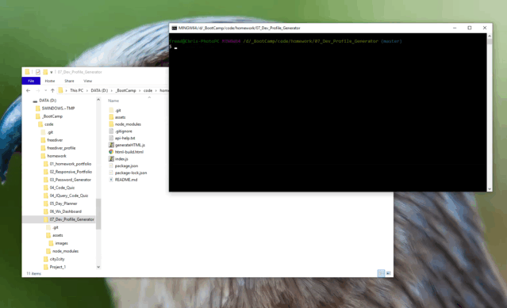

# 07_Dev_Profile_Generator

### Table of Contents
- [Description](#Description)
- [Technologies-Libraries](#Technologies-Libraries)
- [Screenshots](#Screenshots)
- [Link](#Link)
​
### Description
This is a command line program. The program starts by asking for a GitHub username and a favorite color. With this information the code makes a server side ajax call with Axios to get user information from GitHub. Once the calls are returned the data compiled into a string literal with variables. This string is then output to an HTML file and the string is also converted to a PDF file. The PDF is the desired final output of the assignment
​
### Technologies-Libraries
- [NodeJS](https://nodejs.dev/) - Server side code
- [Axios](https://www.npmjs.com/package/axios) - API calls
- [electron-html-to](https://www.npmjs.com/package/electron-html-to) - HTML to PDF conversion
- [inquirer](https://www.npmjs.com/search?q=inquirer) - User inputs on the command line
​
### Screenshots
​

​
### Link
Check it out! 
https://github.com/chrisneal72/07_Dev_Profile_Generator
